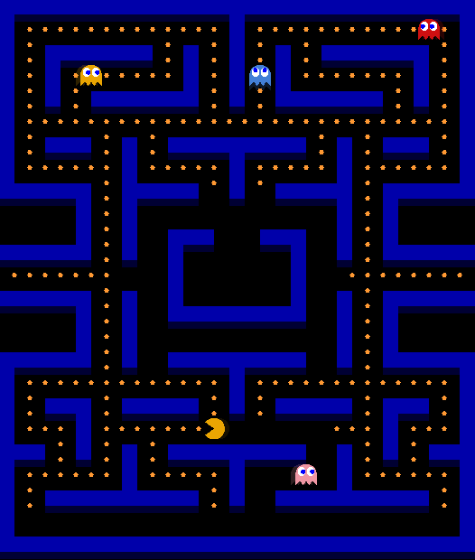

# **Pac-Man**

## Description

Simple Pac-Man game written in Wolfram Mathematica. File contains a single cell returing an interactive image as output. It is possible to upload a custom map from a bitmap (more information below).

## Usage

Evaluate the cell in `pac_man.nb` file to start. Use arrow keys to control the character. 

## Custom maps

To upload the map drop it in the `pac_man.nb` file in a place marked by a comment. A map should be a bitmap where each pixel's color has a following meaning:

| color  | hex | meaning |
| ------ | --- | ------- |
| white | #ffffff | space to be filled with dots |
| red   | #ff0000 | empty space |
| green | #00ff00 | places where ghosts should be spawned |
| blue | #0000ff | a "wall" dividing the rest of the map from the "room" where ghosts are spawned |

You can find the default map in `map.bmp`.